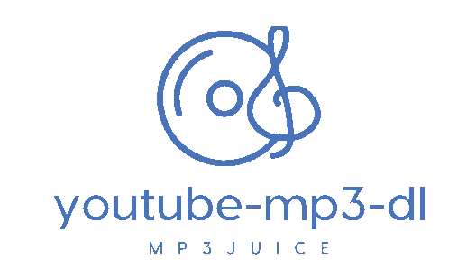

# youtube-mp3-dl (Mp3juice)




- Open Source Mp3Juice Clone.
- Download audio from youtube videos as mp3


### Quick Deployment

- Install docker, docker-compose
```
git clone git@github.com:abinpaul1/youtube-mp3-dl-mp3juice.git
cd youtube-mp3-dl-mp3juice
docker-compose up
```
- Navigate to localhost:3000 on your browser